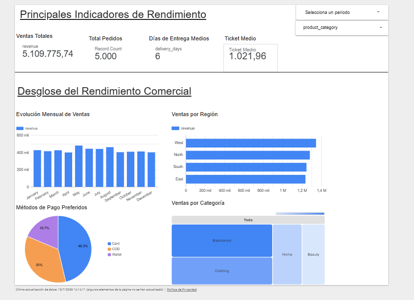

# Análisis de Ventas - E-commerce

Proyecto enfocado en el procesamiento, limpieza y visualización de datos de una tienda online. El objetivo es transformar datos brutos (*raw data*) en un cuadro de mando interactivo útil para entender la evolución del negocio, el rendimiento por regiones y los hábitos de pago de los usuarios.

## Dashboard Interactivo
El reporte final está montado en Looker Studio. Incluye filtros interactivos por fechas, categorías de producto y métodos de pago para explorar las métricas en tiempo real.

[Ver Dashboard en Looker Studio](https://datastudio.google.com/reporting/01692c35-61d1-4d2e-af89-b7be14b18bcc)

### Vista Previa del Informe



## Desarrollo del Proyecto

1. **Análisis Exploratorio (EDA) y Limpieza:** Tratamiento de nulos, corrección de formatos de fecha y limpieza de variables operativas utilizando **Python y Pandas**.
2. **Modelado de Métricas:** Estructuración y cálculo de KPIs clave (Ventas Totales, Ticket Medio y Días de Entrega Medios).
3. **Visualización:** Diseño de la interfaz analítica en Looker Studio cuidando la jerarquía visual y la distribución regional/temporal de los ingresos.

## Stack Tecnológico
* **Lenguaje:** Python
* **Librerías:** Pandas, Jupyter Notebooks
* **BI & Visualización:** Looker Studio

## Estructura del Repositorio
```text
├── dashboard/          # Enlace de acceso y descripción del cuadro de mando interactivo
│   └── link_to_dashboard.md
├── data/               # Datasets en crudo (raw) y limpios (processed)
├── images/             # Capturas del cuadro de mando y recursos visuales
├── notebooks/          # Código paso a paso del análisis y la limpieza
│   ├── 01_exploracion.ipynb
│   └── 02_analisis_ventas.ipynb
└── README.md